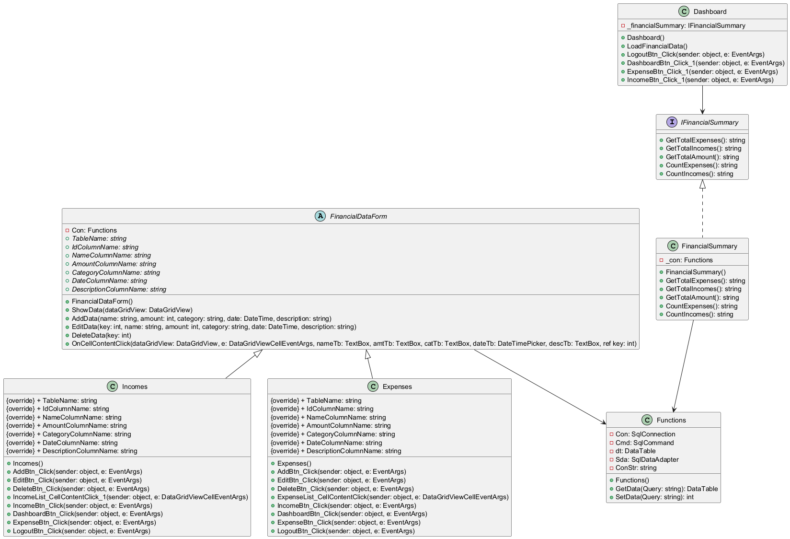

# PatrykSacharz_TymonPukocz_2_Inf_NW_nl_2_domowy_budzet
Projekt aplikacji do śledzenia zarobków i wydatków osobistych, stworzony w języku C# z użyciem .NET, WinForms dla GUI oraz MS SQL Server dla obsługi bazy danych.
## Funkcje
1. Dodawanie wpisów przychodów i wydatków
2. Zapisywanie wpisów w pliku bazy danych
3. Edycja i usuwanie istniejących wpisów
4. Obliczanie bilansu dochodów
5. Wyświetlanie łącznej liczby wpisów obu kategorii

## Wymagania
- **.NET 6.0 lub nowszy**
- **Microsoft Visual Studio**
- **System operacyjny Windows**
## Instalacja
1. Pobierz kod źródłowy oraz plik bazy danych z repozytorium
2. Skonfiguruj *connection string* tak, aby wskazywał na lokalizację pliku bazy danych w twoim komputerze
3. Skompiluj i uruchom aplikację

   
## Diagram UML

