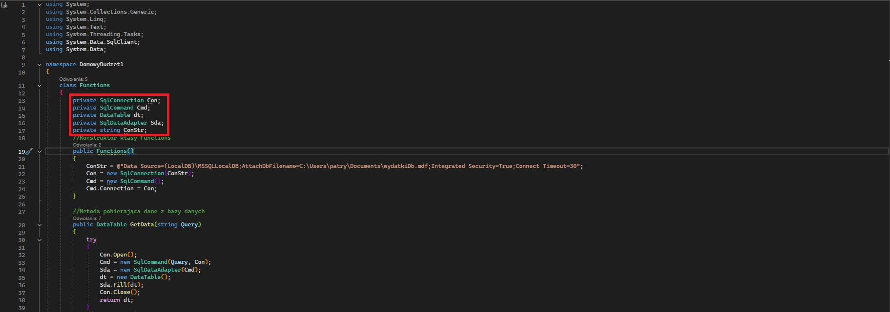
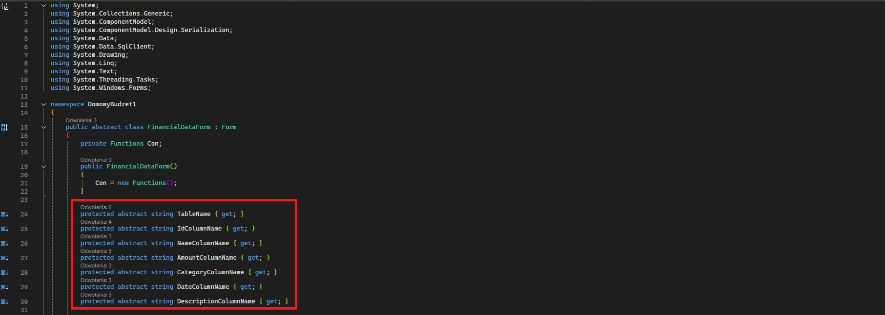

# PatrykSacharz_TymonPukocz_2_Inf_NW_nl_2_domowy_budzet
Projekt aplikacji do śledzenia zarobków i wydatków osobistych, stworzony w języku C# z użyciem .NET, WinForms dla GUI oraz MS SQL Server dla obsługi bazy danych.

## Funkcje
1. Dodawanie wpisów przychodów i wydatków
2. Zapisywanie wpisów w pliku bazy danych
3. Edycja i usuwanie istniejących wpisów
4. Obliczanie bilansu dochodów
5. Wyświetlanie łącznej liczby wpisów obu kategorii

## Wymagania
- **.NET 6.0 lub nowszy**
- **Microsoft Visual Studio 2022**
- **System operacyjny Windows**

## Instalacja
1. Pobierz kod źródłowy oraz plik bazy danych z repozytorium
2. Skonfiguruj *connection string* tak, aby wskazywał na lokalizację pliku bazy danych w twoim komputerze
3. Skompiluj i uruchom aplikację

## Implementacja OOP
- Struktura: 
   - Klasy Incomes i Expenses służą do wprowadzania, edycji i usuwania wpisów w tabelach bazy danych. Dziedziczą one po klasie bazowej FinancialDataForm. 
   - Formularz Dashboard wywołuje klasę zgodną z interfejsem IFinancialSummary do uzyskiwania danych występujących w bazie danych i wyświetla je jako podsumowanie finansowe.
   - Klasa Functions służy do wykonywania wszelkich operacji na bazie danych.
- Dziedziczenie: Klasa FinancialDataForm jest formularzem i klasą bazową dla klas Incomes i Expenses. Dziedziczy metody oraz wspólne pola, które mogą być modyfikowane.

- Biblioteki: Projekt wykorzystuje bibliotekę SqlClient, by rozszerzyć funkcjonalność o klasy obsługujące połączenie i zapytania do bazy danych.

  
- Hermetyzacja: Klasa Functions zawiera prywatne pola, które są dostępne wyłącznie wewnątrz niej oraz publiczne metody, wykorzystywane w innych fragmentach programu do połączenia z bazą danych i wykonywania zapytań.

  
- Interfejsy: IFinancialSummary jest interfejsem, który definiuje metody wymagane dla klas implementujących.

- Polimorfizm: Klasy Incomes i Expenses dziedziczą po FinancialDataForm i implementują jej abstrakcyjne właściwości, co pozwala na specyficzne dla nich zachowanie.

  
- Abstrakcja: FinancialDataForm jest klasą abstrakcyjną z polami, pod które można wstawić odpowiednie dane dla prawidłowego wykonania metod.

  
## Baza danych

## Diagram UML

